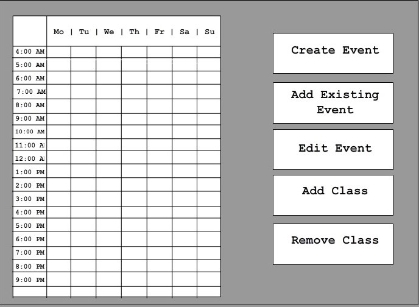

# Sketches

![PDF of all pages in a single file]

Based on the “Page Map” pdf/ jpg, this guide will help you understand the flow of our program’s interface.

# Primary Page
Starting at the upper left part of the diagram is the starting page. After you create an account or log in, the program will take you to the primary screen,

 
which is directly below the starting screen. This is comparable to a home screen. It is the main page of interactivity. 
The primary screen shows your current calendar for the week and gives you 5 buttons you can press. They are: Create Event, Add Existing event,
Edit Event, Add Class, and Remove Class. 

# Create/ Edit Event

 
Create Event and Edit Event will take you to two screens that are virtually identical. The difference is, the create Event page will have a blank form, while the Edit event will have you select an event on the calendar, then the form will auto complete all the relevant information, which can then be edited by the user. The form on the right-hand side of the screen includes a text box to enter the event name, check boxes to select relevant days of the week, Text boxes to enter starting and ending times with correlating radio buttons signifying AM or PM. Near the bottom of the screen on the right-hand side there are two additional check boxes. “Recurring,” Meaning it should be applied every week, and, “Save,” which is for events that are not every week, but are expected to be reused somewhat regularly. Finally, the done button returns you to the previous page.

# Add Existing Event

 
	Add existing event will take you to a page that shows you your calendar as well as events you have saved.  The user can scroll through their existing events to find and select the one they need. When the button is clicked on, it will be added to the calendar for the week and the user is returned to the primary page.

# Add Class

 
	Add class’s first button labeled “Auto-Fill” will automatically pick courses for you to add based on the school’s curriculum path. This button will pick classes for you and it will return you to the primary page. Alternatively, you can add courses yourself. You start off by (optionally) choosing the major you want to take courses in via a drop-down menu. You can then optionally add a course number minimum and maximum. Next there are a series of checkboxes you can select to filter out unwanted options. Finally, there are some radio buttons to control weather you want to see classes that satisfy all of the requirements, or classes that fulfill at least one or more requirements. As the program shows you the classes that satisfy your requirements, it will also grey out those that cannot be added with an explanation as to why.

# Remove Class.
	Remove class will be nearly identical to “Add existing event.” However, instead of showing saved events that you can add to your calendar, it will show classes that can be removed from your calendar. Clicking a class will remove it from your calendar and return you to the home page.
